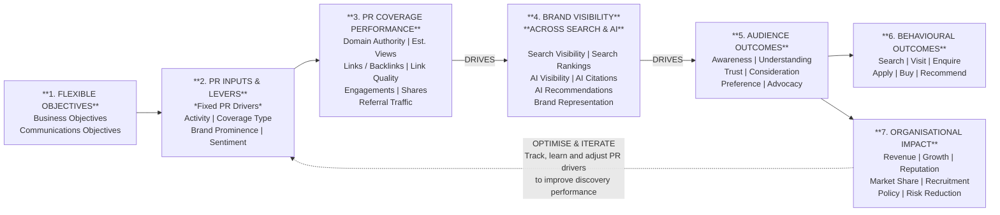

# Modern Earned Media Measurement Framework

*Author: Stella Bayles*
*Status: Signature framework — use in all consultancy, book, and client work*
*Last updated: July 2026*

> **Brand Prominence is the golden thread** — running through coverage quality, search visibility, AI presence, audience salience and business impact.

---

## The Framework at a Glance

The **Modern Earned Media Measurement Framework** is a seven-layer model that maps how PR activity drives discovery, audience outcomes and business impact. It is deliberately structured to separate what makes PR *good* from how well that PR *performed*, and introduces **Brand Visibility Across Search & AI** as a new, distinct discovery measurement layer.

This framework was developed through a synthesis of:
- Stella's own PR measurement and CoverageBook expertise
- AMEC Practitioner's Guide to GEO measurement
- AMEC Global Summit 2026 presentation on PR's data structure problem
- Onclusive GEO Analytics Playbook (critically assessed)
- Deep research into LLM search behaviour and fan-out queries

---

## The Seven Layers

### 1. Flexible Objectives
*The "why" — set per client and campaign*

- **Business Objectives** — what the organisation needs to achieve
- **Communications Objectives** — what needs to change in the audience

These are flexible because they change per client, campaign and brief. Everything else in the framework is evaluated against them.

---

### 2. PR Inputs & Levers — Fixed PR Drivers
*What we do and how well we do it — diagnostic variables for every piece of coverage*

These are **fixed** because they assess the quality of the PR itself, regardless of client or campaign:

| Driver | What It Measures |
|---|---|
| **Activity** | Type and volume of PR activity undertaken |
| **Coverage Type** | Nature of the coverage (feature, mention, interview, etc.) |
| **Brand Prominence** | How prominently the brand appears within the coverage |
| **Sentiment** | Tone and framing of the coverage |

> These are diagnostic variables. Every piece of coverage can be assessed against them regardless of campaign or client. They tell you whether the PR was well executed — not how it performed.

---

### 3. PR Coverage Performance
*How well that coverage performed in the world*

These metrics describe the **performance characteristics** of the coverage, not its editorial quality:

| Metric | Category |
|---|---|
| **Domain Authority** | Publication strength |
| **Estimated Views** | Reach performance |
| **Links / Backlinks** | SEO and authority signal |
| **Link Quality** | Quality of inbound links |
| **Engagements** | Audience interaction |
| **Shares** | Amplification |
| **Referral Traffic** | Direct audience behaviour |

> Domain Authority belongs here — not in drivers — because it tells you how *powerful* a piece of coverage is likely to be, not how well it was executed.

---

### 4. Brand Visibility Across Search & AI *(The New Discovery Layer)*
*How prominently, accurately and favourably the brand appears across search engines and AI-generated answers*

This is the most distinctive and original layer of the framework. It is **not** a PR metric — it is a measurement of the **information environment that exists because of the coverage**.

**Search Visibility:**
- Search Visibility (share of relevant searches)
- Search Rankings (position for priority queries)

**AI Visibility:**
- AI Visibility (presence rate across tested prompts)
- AI Citations (how often brand content is cited as a source)
- AI Recommendations (how often the brand is actively recommended)
- Brand Representation (accuracy and favourability of how the brand is described)

> This layer measures the information environment, not the coverage itself. That is a subtle but critically important distinction.

**The four AI visibility sub-events (do not conflate these):**
1. **Grounded** — information was retrieved or used behind the scenes
2. **Cited** — a source received visible attribution
3. **Mentioned** — the brand was named in the answer
4. **Recommended** — the answer actively selected or endorsed the brand
5. **Referred** — the user clicked through or visited a source

None automatically guarantees the next. A citation does not prove a mention. A mention does not prove trust. A recommendation does not prove behaviour.

---

### 5. Audience Outcomes
*What changed in the audience's mind*

- Awareness
- Understanding
- Trust
- Consideration
- Preference
- Advocacy

---

### 6. Behavioural Outcomes
*What people did as a result*

- Search (branded search uplift)
- Visit (website traffic)
- Enquire
- Apply
- Buy / Convert
- Recommend

---

### 7. Organisational Impact
*What changed for the business*

- Revenue
- Growth
- Reputation
- Market Share
- Recruitment
- Policy
- Risk Reduction

---

## The Mermaid Diagram (Reusable/Adaptable)

---

## How to Apply This Framework to a Client Brief

**Step 1 — Set Flexible Objectives**
Start with the business objective. Work backwards to define the communications objective. Everything is evaluated against these.

**Step 2 — Audit PR Drivers**
Assess existing coverage against the four fixed drivers: Activity, Coverage Type, Brand Prominence, Sentiment.

**Step 3 — Measure Coverage Performance**
Pull CoverageBook data: Estimated Views, Domain Authority, Links, Engagements, Shares, Referral Traffic.

**Step 4 — Audit Brand Visibility Across Search & AI**
Use tools (Ebb, Google Search Console, Otterly, Profound) to measure:
- Search visibility and rankings for priority queries
- AI presence, citation and recommendation rates across ChatGPT, Claude and Gemini
- Accuracy and favourability of brand representation in AI answers

**Step 5 — Map to Audience & Behavioural Outcomes**
Where data is available, connect to: branded search uplift, website visits, enquiries, conversions, brand tracking.

**Step 6 — Connect to Organisational Impact**
Frame the contribution argument using: source correspondence, narrative correspondence, temporal correspondence, competitive correspondence.

**Step 7 — Optimise & Iterate**
Feed learnings back into PR drivers to improve future discovery performance.

---

## The Measurement Questions at Each Layer

| Layer | The Question Being Answered |
|---|---|
| Objectives | What are we trying to achieve? |
| PR Drivers | Did we create high-quality PR? |
| Coverage Performance | How well did that PR perform? |
| Brand Visibility Across Search & AI | How well is the brand being discovered and represented? |
| Audience Outcomes | What changed in the audience? |
| Behavioural Outcomes | What did people do? |
| Organisational Impact | What changed for the organisation? |

---

## Why This Framework Is Distinctive

Most PR measurement models either:
- Stop at coverage outputs (vanity metrics)
- Try to bolt AI onto the Barcelona Principles
- Treat AI visibility as a single blended score

This framework is different because:
1. It **separates PR quality from PR performance** — a distinction most models miss
2. It introduces **Brand Visibility Across Search & AI as its own distinct layer** — not an add-on to coverage metrics
3. It **does not overclaim** — AI visibility is positioned as an intermediate out-take, not automatically the final outcome
4. It is **future-proof** — the discovery layer can expand as new AI surfaces emerge
5. It places **Brand Prominence as the golden thread** running through every layer

---

## The Intellectual Foundation — Key Sources

### AMEC Framework (Three Connected Areas)
AMEC proposes three connected measurement areas that must be triangulated:

| Area | What It Covers |
|---|---|
| **A. Upstream Reputation** | Earned media, reviews, expert commentary, thought leadership, owned content |
| **B. Search & Content Readiness** | Findability, crawlability, indexation, credible links, citeable formats |
| **C. Downstream AI Outputs** | Presence, prominence, framing, source mix, message accuracy, errors |

AMEC maps GEO into the standard evaluation chain: **Outputs → Out-takes → Outcomes → Impact**

- **Outputs:** Coverage, expert commentary, thought leadership, owned pages
- **Out-takes:** AI mentions, citations, prominence, framing, message accuracy, recommendations
- **Outcomes:** AI referral sessions, engagement, conversions, brand tracking
- **Impact:** Sales, reputation, recruitment, policy, risk reduction

### The Onclusive Five Dashboard Measures (with caveats)
1. Visibility — proportion of tested responses in which the brand appears
2. Share of Voice — composite incorporating appearance and rank
3. Average Position — brand's average ranking when present
4. LLM Choice — how often brand is selected first in recommendation prompts
5. Reputation — sentiment score derived from AI-generated responses

> **Caveat:** A visibility score cannot tell you whether communications worked. Being mentioned is not the same as being trusted, considered or acted upon.

### The Onclusive Four Diagnostic Gaps (useful for client workshops)
- **Presence gap:** brand is absent from AI answers
- **Position gap:** competitors rank or are recommended more strongly
- **Narrative gap:** brand is inaccurately or inconsistently described
- **Source gap:** influential sources do not support or sufficiently represent the brand

---

## The LLM Search Behaviour Context

*(From Stella's own research using Ebb tool — see AI Visibility LLM files)*

Different LLMs have fundamentally different search and citation behaviours:

| LLM | Fan-out Behaviour | Citation Behaviour |
|---|---|---|
| **ChatGPT** | No search on 96% of factual questions; always searches on commercial prompts | Cites brand sites, directories and listicles (B2B); sticks to brand sites (consumer) |
| **Claude** | Always searches; consistent ~1 search regardless of prompt type | Cites agencies' own sites 70%+ (B2B); surfaces niche blogs (consumer) |
| **Gemini** | Searches almost everything; spikes dramatically with specific/stacked prompts | Cites agencies' own sites 70%+ (B2B); leans on Reddit and YouTube (consumer) |

**Only 4.1% of domains are cited by all three LLMs.** This means "AI visibility" is not one thing — strategy must be tailored per LLM.

---

## The Prompt Research Framework

*(Developed from Stella's SEO/Answer the Public background applied to LLMs)*

LLM prompts have four dimensions — not just topic:

| Layer | What It Is | Example |
|---|---|---|
| **Layer 1 — Topic** | The obvious subject | SIM only, contracts, roaming |
| **Layer 2 — Intent** | What the person is trying to do | Compare, buy, understand, troubleshoot |
| **Layer 3 — Situation** | The life context behind the prompt | "I'm taking my kids camping in France" |
| **Layer 4 — Conversation** | The follow-up dialogue that develops | Multi-turn conversation about travel needs |

**Prompt types to test for each client:**
- Discovery: "What are some good options for…?"
- Education: "What should I know before choosing…?"
- Comparison: "How do A and B compare for…?"
- Recommendation: "Which is best for someone who…?"
- Reputation: "What is Brand X known for?"
- Risk: "Are there any concerns about Brand X?"
- Evidence: "Which companies are leading on…?"
- Validation: "What do experts or reviews say about…?"

---

## Important Measurement Cautions (for credibility)

- There is no single stable measure of total LLM visibility
- No tool captures the complete market
- A tested prompt set is a sample, not the total audience
- Answers vary by platform, model, market, context and time
- Citation behaviour can change without notice
- A mention does not prove trust
- A citation does not prove a mention
- A recommendation does not prove behaviour
- A visibility change does not prove commercial impact
- AI products should not be merged into one aggregate score
- The testing methodology must be documented and reproducible

> *These are not reasons to avoid measurement. They are what make the measurement credible.*

---

## The Earned-First Proposition (for Splendid and similar clients)

**Not:** "Earned media gets brands mentioned by ChatGPT."

**But:** "Earned-first strategy strengthens the trusted public information environment around a brand. We measure whether that evidence is authoritative, retrievable and accurately reflected across media, search and AI-assisted discovery — and whether it contributes to audience and business outcomes."

---

## Related Files in This Knowledge Base

- [AI_Visibility_LLM_Fan_Out_Research_LinkedIn_Post.md](./AI_Visibility_LLM_Fan_Out_Research_LinkedIn_Post.md) — LLM fan-out query research (200 prompts)
- [AI_Visibility_LLM_Citation_Behaviour_LinkedIn_Post.md](./AI_Visibility_LLM_Citation_Behaviour_LinkedIn_Post.md) — LLM citation overlap research (36,128 citations)
- [AMEC_Global_Summit_2026_PRs_Data_Structure_Problem.md](./AMEC_Global_Summit_2026_PRs_Data_Structure_Problem.md) — AMEC talk on PR data structure
- [Transcript_Splendid_Comms_Followup_Meeting.md](./Transcript_Splendid_Comms_Followup_Meeting.md) — Splendid Comms AI visibility strategy discussion
- [PR_Measurement_Masterclass_Stella_Bayles.md](./PR_Measurement_Masterclass_Stella_Bayles.md) — Full PR measurement masterclass
- [Book_Proposal_Proof_of_Influence_Stella_Bayles.md](./Book_Proposal_Proof_of_Influence_Stella_Bayles.md) — Book proposal (framework features here)
